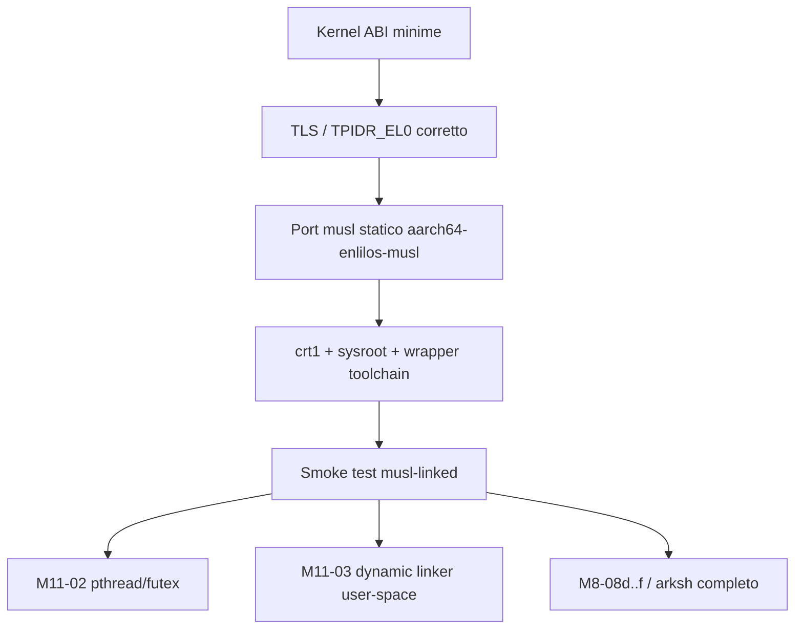

# M11-01 · Studio di Implementazione musl libc per EnlilOS

Data: 2026-04-09

## Obiettivo

Portare **musl libc** come runtime C standard di EnlilOS, in modo da poter compilare ed eseguire
programmi C reali senza wrapper ad hoc come [include/user_svc.h](/Users/nicolo/nros/include/user_svc.h).

Il risultato atteso di `M11-01` non e' ancora un userland completo Linux-like, ma una base solida:

- toolchain `aarch64-enlilos-musl-*`
- binari **statici** linked con musl
- startup ABI corretto (`argc/argv/envp/auxv`)
- `stdio`, `malloc`, file I/O, `fork/exec/wait`, segnali base, pipe, `termios`
- nessuna dipendenza da `pthread` o dynamic linker user-space, che restano a `M11-02` e `M11-03`

---

## Executive Summary

### Raccomandazione

La strada piu' pulita per `M11-01` e' questa:

1. **portare musl in modalita' statica e single-thread**
2. **aggiungere prima i gap ABI minimi nel kernel**
3. **introdurre TLS vero con salvataggio/ripristino di `TPIDR_EL0`**
4. **costruire una toolchain dedicata `aarch64-enlilos-musl`**
5. **validare con una piccola suite di binari musl-linked nell'initrd**

### Perche' questa scelta

- riduce il delta rispetto a musl rispetto a una libc custom
- sblocca `arksh`, utility POSIX, server user-space reali e compilazione C standard
- separa bene il lavoro:
  - `M11-01` = libc statica, single-thread
  - `M11-02` = `pthread`/`futex`
  - `M11-03` = linker dinamico user-space

### Punto critico da non sottovalutare

Il gap piu' importante **non** e' solo nelle syscall mancanti.  
Il gap strutturale vero e' il **TLS / thread pointer**:

- musl usa TLS anche in modalita' single-thread
- oggi EnlilOS **non salva/ripristina `TPIDR_EL0`** nei context switch
- senza questo, `errno`, stato libc e parte del runtime musl non sono affidabili

---

## Stato Attuale del Sistema

### Gia' pronto e riusabile

Queste parti del kernel sono gia' abbastanza mature per supportare un primo porting musl:

- loader ELF64 con `argc/argv/envp/auxv` in [kernel/elf_loader.c](/Users/nicolo/nros/kernel/elf_loader.c)
- `fork()` + COW
- `execve()`
- `waitpid()`
- `brk()`
- `mmap()` / `munmap()` / `msync()`
- `open()` / `read()` / `write()` / `close()` / `fstat()` / `getdents()`
- `pipe()` / `dup()` / `dup2()`
- `chdir()` / `getcwd()`
- `sigaction()` / `sigprocmask()` / `kill()`
- `tcgetattr()` / `tcsetattr()` / `isatty()`
- `/dev/stdin`, `/dev/stdout`, `/dev/stderr`, `/dev/null`, `/dev/tty`
- rootfs `initrd-cpio`, `/proc`, `/data`, `ext4`

### Gia' verificato oggi

Il sistema parte da uno stato buono per iniziare `M11-01`:

- `make test` passa con `SUMMARY total=25 pass=25 fail=0`
- il demo [user/posix_demo.c](/Users/nicolo/nros/user/posix_demo.c) verifica gia':
  - env bootstrap
  - `getcwd/chdir`
  - `pipe/dup/dup2`
  - `tcgetattr/tcsetattr/isatty`

---

## Gap Reali per Portare musl

### 1. TLS / Thread Pointer

Questo e' il gap architetturale principale.

**Problema attuale**

- non esiste nessun riferimento a `TPIDR_EL0` nel kernel
- [kernel/sched_switch.S](/Users/nicolo/nros/kernel/sched_switch.S) salva solo i registri callee-saved e lo stack
- [boot/vectors.S](/Users/nicolo/nros/boot/vectors.S) non salva/ripristina il thread pointer EL0

**Per musl serve**

- un valore `TPIDR_EL0` per task
- salvataggio del TP del task corrente quando si entra nel kernel e/o si effettua switch
- ripristino del TP del task successivo prima del ritorno a EL0
- corretto mantenimento del TP anche dopo:
  - `fork()`
  - `execve()`
  - segnali
  - context switch

**Lavoro da fare**

- aggiungere `tpidr_el0` nel contesto task
- salvare/ripristinare `TPIDR_EL0` nel path scheduler
- assicurare che il child di `fork()` erediti correttamente il TP
- decidere la politica su `execve()`:
  - il TP precedente va resettato
  - il nuovo runtime musl lo reinizializza nel suo startup

**Nota**

Questo punto da solo giustifica una sottofase dedicata di `M11-01`.

---

### 2. Syscall minime mancanti per musl

Il backlog ne elenca alcune, ma per un porting pratico serve una classificazione piu' precisa.

#### Must-have per il primo bootstrap musl statico

Queste sono le prime syscall da aggiungere o mappare:

| Area | Stato attuale | Azione |
|---|---|---|
| `getpid` | assente | aggiungere |
| `getppid` | assente | aggiungere |
| `nanosleep` | assente | aggiungere |
| `gettimeofday` | assente | aggiungere o implementare in libc sopra `clock_gettime` |
| `getuid/getgid/geteuid/getegid` | assenti | stub a `0` |
| `lseek` | assente | aggiungere |
| `writev` | assente | fortemente raccomandata |
| `readv` | assente | raccomandata |
| `fcntl` minimo | assente | aggiungere |

#### Fortemente raccomandate per ridurre patch invasive su musl

| Syscall/API | Motivo |
|---|---|
| `openat` | musl e molto software moderno usano `openat` come primitiva base |
| `fstatat` / `newfstatat` | utile per port piu' pulito e compatibilita' futura |
| `ioctl` minimo | almeno `ENOTTY`, poi tty/winsize |
| `uname` | molti programmi la interrogano subito |

#### Rimandabili a M11-02 / oltre

| Syscall/API | Milestone |
|---|---|
| `clone` | M11-02 |
| `futex` | M11-02 |
| `set_tid_address` | M11-02 |
| robust futex | M11-02+ |
| dynamic loader ABI | M11-03 |

---

### 3. `lseek()` e file semantics

`musl` puo' funzionare senza threading, ma non senza un modello file abbastanza POSIX.

**Gap attuale**

- il VFS mantiene `file->pos`, ma non esiste syscall `lseek`
- senza `lseek`, parte di `stdio`, `fseek`, `ftell`, parser e librerie di supporto restano zoppi

**Azione raccomandata**

Implementare `lseek(fd, off, whence)` su:

- file VFS kernel-side
- file remoti `vfsd` con shadow handle
- pipe/FIFO -> `-ESPIPE`
- tty/char device -> comportamento da definire, di norma `-ESPIPE`

---

### 4. `writev()` / `readv()`

Questo punto non e' sempre esplicitato nel backlog, ma e' importante.

Molte implementazioni `stdio` e percorsi libc usano `writev()` per scrivere:

- buffer gia' accumulato
- payload nuovo

in una sola operazione logica.

**Raccomandazione**

- aggiungere `readv` e `writev` nel kernel
- anche se inizialmente l'implementazione e' semplice:
  - bounded
  - max iov limitato
  - copia lineare sui backend correnti

Questo riduce drasticamente le patch locali a musl.

---

### 5. `fcntl()` minimo

Per una libc usabile serve almeno:

- `F_GETFL`
- `F_SETFL`
- `F_DUPFD`
- `F_DUPFD_CLOEXEC` se possibile
- `F_SETFD` / `FD_CLOEXEC`

**Perche' serve gia' in M11-01**

- `dup`/`dup2` sono gia' presenti
- manca il layer POSIX normale per manipolare flag e cloexec
- diversi runtime e utility danno per scontato `fcntl`

**Nota**

Se `FD_CLOEXEC` non viene introdotto qui, va almeno dichiarato come limite esplicito della v1.

---

### 6. `openat()` come primitiva moderna

Anche se EnlilOS ha `open()`, per il porting musl conviene **aggiungere `openat()`** presto.

**Perche'**

- riduce il delta rispetto al comportamento atteso da software moderno
- evita patch su wrapper libc che altrimenti dovrebbero degradare tutto a `open()`
- prepara meglio `M11-05` (compat Linux)

**Approccio consigliato**

- implementare `openat(dirfd, path, flags, mode)`
- supportare almeno:
  - `AT_FDCWD`
  - path assoluti
  - path relativi rispetto a `cwd`
- rimandare directory-relative complesse a una fase successiva, se necessario

---

### 7. `ioctl()` minimo

musl puo' essere portata anche senza una `ioctl()` ricca, ma un minimo conviene introdurlo.

**Obiettivo minimo**

- `ioctl(fd, request, argp)`
- default `-ENOTTY` / `-EINVAL`
- supporto iniziale consigliato:
  - tty query base
  - in prospettiva `TIOCGWINSZ` / `TIOCSWINSZ`

**Perche' non e' il primo blocker**

Per il bootstrap si possono mappare `tcgetattr`/`tcsetattr` direttamente alle syscall dedicate,
senza passare da `ioctl`. Ma prima o poi molti programmi TUI la useranno.

---

### 8. Errno coverage

L'insieme di `errno` attuale in [include/syscall.h](/Users/nicolo/nros/include/syscall.h) e' buono per i demo,
ma e' ancora stretto per una libc generale.

**Da ampliare almeno con**

- `ENOTTY`
- `ESPIPE`
- `EMFILE`
- `ENODEV`
- `ENOTSUP` / `EOPNOTSUPP`
- `ENOEXEC`
- `EOVERFLOW`
- `ELOOP`
- `ENOSR`/`ENODATA` solo se servono piu' avanti

Questo non blocca la compilazione di musl in assoluto, ma rende piu' pulita la compatibilita'
con software reale.

---

## Gap Toolchain / Runtime

### 1. Oggi l'user-space e' freestanding

Dal [Makefile](/Users/nicolo/nros/Makefile):

- `-ffreestanding`
- `-nostdlib`
- `-nostartfiles`
- `-fno-builtin`

Questo e' perfetto per i demo correnti, ma `M11-01` deve sostituire il modello con:

- `crt1.o`
- `crti.o`
- `crtn.o`
- `libc.a`
- `libm.a` e altri archivi musl statici
- `gcc --sysroot=...` o wrapper toolchain equivalente

### 2. Startup C (`crt1`)

EnlilOS entra gia' con:

- `x0 = argc`
- `x1 = argv`
- `x2 = envp`
- `x3 = auxv`

Questo e' un ottimo punto di partenza.

**Da costruire**

- startup musl/EnlilOS per AArch64 che invochi `__libc_start_main`
- variante statica come target iniziale
- PIE/dynamic lasciate a `M11-03`

### 3. Dynamic linker

EnlilOS ha oggi un profilo dinamico custom con [user/ld_enlil.c](/Users/nicolo/nros/user/ld_enlil.c),
ma **non e' ancora il linker dinamico user-space standard musl**.

Per `M11-01` la raccomandazione e':

- **non** cercare di chiudere anche il linker dinamico
- puntare a **libc statica**
- rimandare `ld-musl-aarch64.so.1` a `M11-03`

---

## Strategia Tecnica Consigliata

## A. Scope della v1 di M11-01

### In scope

- musl **statica**
- single-thread
- `stdio`, `stdlib`, `string`, `unistd`, `fcntl` minimo, `signal` base
- file I/O su VFS
- `malloc` su `brk`/`mmap`
- `fork/exec/wait`
- `pipe/dup/dup2`
- `termios` base

### Out of scope

- `pthread`
- futex
- TLS multi-thread completo
- dynamic linker musl
- `dlopen`
- socket BSD
- piena compat Linux/glibc

---

## B. Porting strategy consigliata

### Opzione raccomandata

**Vendor musl + patchset EnlilOS piccolo e separato**

Struttura suggerita:

```text
third_party/musl/              # sorgente upstream vendorizzato
ports/musl/patches/            # patch EnlilOS ordinate e minime
ports/musl/config.mak          # config build locale
toolchains/aarch64-enlilos-musl-gcc
toolchains/aarch64-enlilos-musl-ar
toolchains/aarch64-enlilos-musl-ranlib
```

### Da evitare

- copiare pezzi di musl dentro `user/`
- riscrivere una libc custom locale
- fare un fork grossolano non riallineabile

---

## C. Layer di adattamento musl

### Parti da adattare davvero

1. `arch/aarch64` syscall glue
2. `bits/` headers per il target EnlilOS
3. `crt` startup
4. `syscall` number mapping
5. `termios`/signal ABI compatibile con i tipi musl
6. init TLS per AArch64 + TP

### Obiettivo

Minimizzare il numero di file upstream toccati e concentrare il delta in:

- `arch/aarch64`
- `include/bits`
- startup/crt
- poche funzioni `src/linux` sostituite da equivalenti EnlilOS

---

## Work Breakdown Dettagliato

## 1. Kernel ABI da aggiungere

### Blocco A — base libc

- [ ] `getpid`
- [ ] `getppid`
- [ ] `nanosleep`
- [ ] `gettimeofday` oppure wrapper libc sopra `clock_gettime`
- [ ] `getuid`
- [ ] `getgid`
- [ ] `geteuid`
- [ ] `getegid`
- [ ] `lseek`
- [ ] `writev`
- [ ] `readv`
- [ ] `fcntl` minimo

### Blocco B — raccomandato subito dopo

- [ ] `openat`
- [ ] `ioctl` minimo
- [ ] `uname`
- [ ] `fstatat` / `newfstatat`

### Blocco C — niceties

- [ ] `umask`
- [ ] `access`
- [ ] `getcwd` Linux-style alias se serve a compat layer
- [ ] `times`, `sysconf` support lato libc

---

## 2. Scheduler / context / TLS

- [ ] aggiungere `tpidr_el0` al contesto task
- [ ] salvare `TPIDR_EL0` del task uscente
- [ ] ripristinare `TPIDR_EL0` del task entrante
- [ ] propagare il TP nel child di `fork()`
- [ ] resettare il TP nel path `execve()`
- [ ] aggiungere selftest kernel-side dedicato alla preservazione del thread pointer

**Definizione di done di questo blocco**

Un programma user-space che scrive/legge `TPIDR_EL0` vede lo stesso valore:

- dopo `sched_yield()`
- dopo preemption timer
- dopo `fork()` nel parent e nel child

---

## 3. Loader / ABI stack

L'ABI stack attuale e' gia' buona, ma per musl e' bene esplicitare:

- [ ] verificare che `auxv` basti per musl statico
- [ ] aggiungere eventuali tag `AT_UID`, `AT_EUID`, `AT_GID`, `AT_EGID` se utili
- [ ] documentare se `AT_RANDOM` viene richiesto dal bootstrap musl scelto
- [ ] chiarire il comportamento su `PT_TLS`

**Nota pratica**

Se il bootstrap musl usato richiede `AT_RANDOM`, conviene aggiungerlo gia' in `M11-01`.

---

## 4. Port musl vero e proprio

- [ ] import sorgente musl in `third_party/musl`
- [ ] definire target `aarch64-enlilos-musl`
- [ ] preparare `bits/alltypes.h` e header target-specific
- [ ] mappare i numeri syscall EnlilOS
- [ ] adattare `termios`, `signal`, `stat`, `mmap`, `fcntl`
- [ ] creare startup `crt1/crti/crtn`
- [ ] generare `libc.a`

---

## 5. Toolchain

- [ ] scegliere strategia:
  - `musl-cross-make`
  - wrapper GCC + sysroot musl
- [ ] produrre:
  - `aarch64-enlilos-musl-gcc`
  - `aarch64-enlilos-musl-ar`
  - `aarch64-enlilos-musl-ranlib`
  - sysroot con `include/`, `lib/`, `crt*.o`
- [ ] integrare target nel build del repo
- [ ] aggiungere un target tipo:
  - `make musl-toolchain`
  - `make musl-smoke`

---

## 6. Layout runtime / filesystem

Per il primo runtime musl conviene aggiungere almeno:

- [ ] `/lib`
- [ ] `/usr/lib`
- [ ] `/tmp`
- [ ] `/etc`

Per la v1 statica non serve ancora un filesystem Linux-like completo, ma questi path
rendono il bootstrap piu' pulito.

**Gia' disponibili**

- `/dev/null`
- `/dev/tty`
- `/dev/stdin`
- `/dev/stdout`
- `/dev/stderr`

---

## 7. Suite di validazione musl

### Binari minimi da compilare con musl

- [ ] `hello-musl`
- [ ] `stdio-musl`
- [ ] `malloc-musl`
- [ ] `env-musl`
- [ ] `fork-exec-musl`
- [ ] `pipe-termios-musl`

### Cosa deve provare ogni test

#### `hello-musl`
- `main(int,char**,char**)`
- `printf`
- `exit`

#### `stdio-musl`
- `fopen/fread/fwrite/fclose`
- seek base (`fseek/ftell`) -> richiede `lseek`

#### `malloc-musl`
- `malloc/free/realloc/calloc`
- mix `brk` / `mmap`

#### `env-musl`
- `getenv("PATH")`, `getenv("HOME")`, `getenv("TERM")`
- `setenv/unsetenv` lato libc

#### `fork-exec-musl`
- `fork`
- `execve`
- `waitpid`
- `getpid/getppid`

#### `pipe-termios-musl`
- `pipe`
- `dup2`
- `isatty`
- `tcgetattr/tcsetattr`

### Integrazione con EnlilOS

I primi binari musl conviene inserirli nell'`initrd` e poi lanciare:

- da boot console
- da `nsh`
- da selftest dedicato `musl-core`

---

## Criteri di Accettazione di M11-01

`M11-01` puo' dirsi chiusa quando sono vere tutte queste condizioni:

- [ ] esiste una toolchain `aarch64-enlilos-musl-gcc`
- [ ] si compila un programma C **senza** usare `user_svc.h`
- [ ] binari statici musl partono con loader/kernel correnti
- [ ] `printf`, `malloc`, `fopen`, `fork`, `execve`, `waitpid` funzionano
- [ ] `pipe/dup/dup2` funzionano da programma musl-linked
- [ ] `termios` base e `isatty` funzionano da programma musl-linked
- [ ] il TP/TLS e' preservato nei context switch
- [ ] esiste una suite di smoke test automatica

---

## Dipendenze e Ordine Consigliato



### Sequenza concreta raccomandata

1. aggiungere syscall minime + `lseek` + `writev`
2. implementare salvataggio/ripristino `TPIDR_EL0`
3. vendorizzare musl e preparare il target
4. costruire `crt1` e `libc.a`
5. compilare `hello-musl`
6. compilare `stdio-musl` e `malloc-musl`
7. chiudere `fork/exec/termios`
8. aggiungere selftest e target build dedicati

---

## Rischi Principali

### Rischio 1 — sottostimare TLS

E' il rischio maggiore.  
Se viene ignorato, il porting puo' "sembrare" quasi finito ma fallire in modo sporadico
su `errno`, `stdio`, locale o stato interno libc.

### Rischio 2 — patchare troppo musl invece di chiudere i gap nel kernel

Se si evita di implementare `lseek`, `writev`, `fcntl`, `openat` e si piega musl per usare
solo le primitive gia' presenti, il delta locale diventa troppo costoso da mantenere.

### Rischio 3 — voler chiudere anche threading e dynamic linker nello stesso passo

`M11-01` deve restare concentrata su:

- libc statica
- single-thread
- ABI e toolchain

`pthread` e `.so` vanno lasciati alle milestone successive.

---

## Decisione Consigliata

### Scelta consigliata per EnlilOS

Chiudere `M11-01` come:

**"musl static single-thread, TLS corretto, stdio/malloc/process/file I/O pronti"**

e lasciare esplicitamente a:

- `M11-02`: `clone`, `futex`, `pthread`, semafori POSIX, mutex/condvar
- `M11-03`: `ld-musl-aarch64.so.1`, `dlopen`, shared libc, loader dinamico user-space

Questa divisione e' coerente con il backlog, con il codice attuale e con il rischio tecnico reale.

---

## Deliverable Attesi del Lavoro

Quando iniziera' l'implementazione concreta, i deliverable dovrebbero essere almeno:

- [ ] `third_party/musl/`
- [ ] `ports/musl/patches/`
- [ ] `toolchains/aarch64-enlilos-musl-gcc`
- [ ] `sysroot/` o equivalente
- [ ] `crt1.o`, `crti.o`, `crtn.o`
- [ ] `libc.a`
- [ ] 4-6 test EL0 compilati con musl
- [ ] target `make musl-smoke`
- [ ] selftest/documentazione aggiornata

---

## Conclusione

`M11-01` e' fattibile con la base attuale di EnlilOS, ma va trattata come una milestone
**di ABI + runtime**, non solo come "aggiungiamo una libreria".

Il sistema ha gia' quasi tutti i mattoni grossi:

- process model
- memoria virtuale
- segnali
- VFS
- pipe / cwd / termios

I veri blocchi rimasti sono:

1. **TLS / `TPIDR_EL0`**
2. **syscall POSIX mancanti ma piccole**
3. **toolchain/sysroot/crt puliti**

Se questi tre blocchi vengono affrontati in quest'ordine, `M11-01` puo' diventare
una milestone ad alto rendimento e sbloccare davvero il resto della FASE 3.
