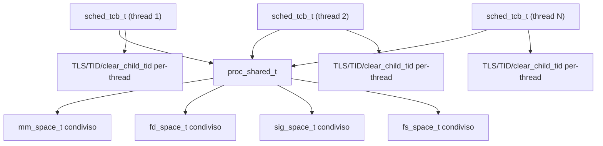
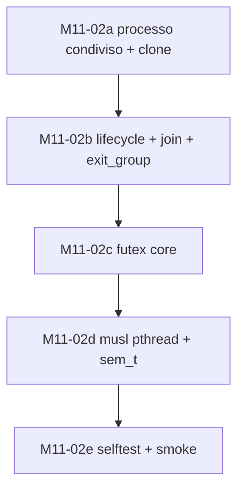

# M11-02 · Studio di Implementazione POSIX Threading (`pthread`)

Data: 2026-04-10

Dipendenze gia' chiuse:
- `M11-01` bootstrap musl/toolchain `v1`
- `M8-01` fork + COW
- `M8-06` `ksem`
- `M8-07` `kmon`

Stato milestone ad oggi:
- `M11-02a` completata `v1`
- `M11-02b` completata `v1`
- `M11-02c` completata `v1`
- `M11-02d` completata `v1`
- `M11-02e` completata `v1`

---

## Obiettivo

Chiudere `M11-02` significa portare EnlilOS dal profilo:

- libc statica single-thread

al profilo:

- `pthread` utilizzabile per programmi C/C++ reali
- mutex/condvar user-space
- `sem_t` POSIX
- TLS multi-thread coerente
- join/detach corretti

senza introdurre un dynamic linker user-space completo, che resta in `M11-03`.

---

## Executive Summary

Il punto chiave di `M11-02` non e' il solo `futex`.

Il vero salto architetturale e' introdurre un piccolo livello di stato condiviso
tra i thread dello stesso processo. Oggi EnlilOS ha ancora diversi sottosistemi
modellati per-task:

- fd table
- signal state
- identita' di processo
- cleanup su `exit`

Quindi `M11-02` va affrontata in questo ordine:

1. introdurre il modello `processo + thread`
2. aggiungere `clone`/`gettid`/`set_tid_address`/`exit_group`/`tgkill`
3. implementare `futex`
4. collegare musl `pthread` e `sem_t`
5. validare con smoke test multi-thread

---

## Stato Attuale del Codice

### Gia' pronto

- ELF loader con `PT_TLS`, `TPIDR_EL0`, `argc/argv/envp/auxv`
- `fork()` + COW
- `execve()`
- `waitpid()`
- `mmap()` / `munmap()` / `msync()`
- `pipe()` / `dup()` / `dup2()`
- `sigaction()` / `sigprocmask()` / `kill()`
- `ksem` kernel-side
- `kmon` kernel-side
- sysroot/toolchain musl bootstrap `v1`

### Gia' verificato runtime

- selftest completo verde: `SUMMARY total=40 pass=40 fail=0`
- `tls-tp` e `crt-startup` confermano che la base TLS single-thread e' corretta
- `MUSLFORK.ELF` e `MUSLPIPE.ELF` confermano che il bootstrap libc e' stabile

---

## Gap Reali da Chiudere

### 1. Manca un vero modello `processo + thread`

Oggi il kernel tratta ogni task user-space come entita' quasi-processo:

- `getpid()` torna il `pid` del task
- `waitpid()` ragiona su `parent_pid`
- `signal_state[]` e' indicizzato per task
- `fd_tables[SCHED_MAX_TASKS][MAX_FD]` e' per-task
- `sched_task_exit_with_code()` fa cleanup completo delle risorse del task

Questo modello basta per processi separati, ma non per:

- `CLONE_VM`
- `CLONE_FILES`
- `CLONE_SIGHAND`
- `CLONE_THREAD`

### 2. Syscall critiche mancanti

Per una `pthread` seria mancano almeno:

- `clone()`
- `gettid()`
- `set_tid_address()`
- `exit_group()`
- `tgkill()`
- `futex()`

Per stack guard e layout musl e' opportuno anticipare anche una `mprotect()`
minimale, oggi pianificata solo piu' avanti nel backlog Linux compat.

### 3. `pthread_join()` non puo' essere implementata bene con `waitpid()`

La formulazione attuale del backlog (`pthread_join() -> waitpid()`) e' troppo
ottimistica e, in pratica, sbagliata.

La strada corretta per il profilo musl e':

- `CLONE_CHILD_CLEARTID`
- `set_tid_address()`
- `futex(FUTEX_WAIT)` sul `clear_child_tid`

`waitpid()` deve restare la primitive per i processi figli, non per i thread.

### 4. `sem_t` non e' ancora davvero chiusa

`ksem` esiste gia' ed e' ottima come base, ma il wrapper POSIX `sem_t`
non e' automaticamente "fatto" solo perche' `M11-01` e' chiusa.

Va implementato esplicitamente lato musl/user-space.

### 5. `pthread_mutex_t` / `pthread_cond_t` non vanno mappati su `kmon`

`kmon` e' utile come primitiva kernel e per monitor/C++ in futuro, ma il layer
ABI POSIX standard va costruito sopra `futex`, non sopra handle kernel opachi.

Sintesi:

- `sem_t` -> `ksem`
- `pthread_mutex/cond` -> `futex`
- `kmon` resta infrastruttura utile, ma non sostituisce `pthread_cond_t`

---

## Decisioni Architetturali Consigliate

### 1. Separare `tid` e `tgid`

Proposta `v1`:

- `tid` = `current_task->pid`
- `tgid` = pid del thread leader del processo

Semantica:

- `gettid()` -> `tid`
- `getpid()` -> `tgid`
- `kill(pid, sig)` -> segnale process-directed al thread-group
- `tgkill(tgid, tid, sig)` -> segnale thread-directed

### 2. Introdurre uno stato condiviso per processo

Serve un oggetto condiviso, qui chiamato `proc_shared_t`, con refcount.

Contenuto minimo:

```c
typedef struct proc_shared {
    uint32_t   tgid;
    uint32_t   leader_tid;
    uint32_t   live_threads;
    uint8_t    exiting;
    mm_space_t *mm;
    fd_space_t *files;
    sig_space_t *sighand;
    fs_space_t *fs;
} proc_shared_t;
```

Idea chiave:

- il thread e' ancora rappresentato da `sched_tcb_t`
- il processo diventa l'owner condiviso di:
  - address space
  - fd table
  - signal dispositions
  - cwd / mount namespace view

### 3. Join tramite `clear_child_tid`

Alla terminazione del thread:

1. il kernel scrive `0` in `*clear_child_tid`
2. esegue `futex_wake(uaddr, 1)`
3. rilascia le risorse per-thread
4. libera le risorse per-processo solo quando `live_threads == 0`

### 4. Pull-forward di `mprotect()` minimale

Per il profilo `pthread` conviene anticipare da `M11-05` una `mprotect()` minima:

- cambio permessi su range user gia' mappati
- supporto almeno a `PROT_NONE`, `PROT_READ`, `PROT_WRITE`
- sufficiente per stack guard page

### 5. Scope realistico `v1`

Dentro `M11-02` `v1`:

- `pthread_create`
- `pthread_join`
- `pthread_detach`
- `pthread_self`
- `pthread_equal`
- `pthread_kill`
- `pthread_sigmask`
- `pthread_mutex_*` baseline
- `pthread_cond_*` baseline
- `sem_t` POSIX sopra `ksem`

Fuori scope `v1`:

- robust futex list
- `FUTEX_LOCK_PI`
- `pthread_cancel`
- affinity / scheduler attributes completi
- process-shared pthread objects
- `clone3()`

---

## Blocco Architetturale



---

## Proposta di Numerazione Syscall

Lo spazio reale oggi libero in `include/syscall.h` suggerisce questa mappa:

| Nr | Syscall | Motivo |
|----|---------|--------|
| 56 | `clone` | subito dopo il blocco `M11-01a` |
| 57 | `gettid` | strettamente collegata a `clone` |
| 58 | `set_tid_address` | join/clear-child-tid |
| 59 | `exit_group` | separa process-exit da thread-exit |
| 65 | `futex` | numero libero, evita collisioni con `cap` e `kmon` |
| 66 | `tgkill` | segnale thread-directed |
| 67 | `mprotect` | guard page minima per stack thread |

Nota importante: il vecchio numero ipotizzato per `futex` (`98`) non e' piu'
utilizzabile, perche' oggi `98` e' gia' occupata da `SYS_KMON_EXIT`.

---

## Blocco 1 — M11-02a · Processo condiviso + `clone()`

### Obiettivo

Introdurre il modello thread-group e il subset `clone()` necessario a musl.

### Deliverable

- `proc_shared_t` con refcount
- `fd_space_t` condivisibile
- `sig_space_t` condivisibile
- `fs_space_t` condivisibile
- `getpid()` -> `tgid`
- nuova `gettid()`
- `clone()` con subset:
  - `CLONE_VM`
  - `CLONE_FILES`
  - `CLONE_SIGHAND`
  - `CLONE_THREAD`
  - `CLONE_SETTLS`
  - `CLONE_CHILD_CLEARTID`
  - `CLONE_CHILD_SETTID`
  - `CLONE_PARENT_SETTID`

### File attesi

- `include/syscall.h`
- `include/sched.h`
- `kernel/sched.c`
- `kernel/syscall.c`
- `kernel/signal.c`
- `kernel/mmu.c`

### Punto critico

`CLONE_FILES` non puo' essere simulata copiando la tabella fd al clone: serve un
vero oggetto condiviso. Stesso discorso per `CLONE_SIGHAND`.

---

## Blocco 2 — M11-02b · Lifecycle thread, join, exit di gruppo

### Obiettivo

Rendere corretti:

- thread exit
- process exit
- join
- detach
- signal delivery per-thread/per-process

### Deliverable

- `set_tid_address()`
- `exit_group()`
- `tgkill()`
- cleanup differenziato:
  - thread resources
  - process shared resources
- `clear_child_tid` + wake su futex
- `pthread_join()` modellabile sopra futex

### Punto critico

L'attuale `sched_task_exit_with_code()` distrugge sempre tutto il mondo del task.
Con i thread dovra' distinguere:

- ultimo thread del processo
- thread non leader
- leader che termina con altri thread ancora vivi

---

## Blocco 3 — M11-02c · Futex core

**Stato attuale:** completata `v1`

### Obiettivo

Aggiungere il primitive user-space fondamentale per mutex, condvar e join.

### Scope `v1`

- `FUTEX_WAIT`
- `FUTEX_WAKE`
- `FUTEX_REQUEUE` o `FUTEX_CMP_REQUEUE` per condvar/broadcast
- flag `PRIVATE` ignorato o trattato come hint

### Non scope `v1`

- `FUTEX_LOCK_PI`
- robust futex list
- `WAIT_BITSET`

### Implementazione consigliata

- hash table statica per bucket
- waiter senza allocazioni dinamiche nel hot path
- wait cooperativo bounded come il resto del kernel attuale

### File attesi

- `include/syscall.h`
- `kernel/syscall.c`
- `kernel/futex.c` + `include/futex.h`

### Chiusura effettiva della v1

- `FUTEX_WAIT`
- `FUTEX_WAKE`
- `FUTEX_REQUEUE`
- `FUTEX_CMP_REQUEUE`
- wake su `clear_child_tid` nel path di uscita thread
- demo `/FUTEXDEMO.ELF`
- selftest `futex-core`

---

## Blocco 4 — M11-02d · musl `pthread` + `sem_t`

### Obiettivo

Usare le primitive kernel nuove per chiudere il runtime POSIX user-space.

### Stato attuale

Completato `v1`, con:

- `<pthread.h>`, `<signal.h>`, `<semaphore.h>`
- `pthread_create/join/detach/self/equal/kill/sigmask`
- `pthread_mutex_*` / `pthread_cond_*` sopra `futex`
- `sem_t` named/anon sopra `ksem`
- demo `PTHREADDEMO.ELF` e `SEMDEMO.ELF`
- selftest `musl-pthread` e `musl-sem`

Il limite storico sul TLS multi-thread e' ora chiuso da `M11-02e`: i thread figli
allocano un blocco TLS completo a partire dal template `PT_TLS`, quindi `__thread`
e `errno` thread-local non condividono piu' stato tra thread.

### Deliverable

- `<pthread.h>`
- `<semaphore.h>`
- wrapper `sem_t` sopra `ksem`
- `pthread_mutex_*` sopra `futex`
- `pthread_cond_*` sopra `futex`
- `pthread_create/join/detach/self/equal/kill/sigmask`

### Decisione importante

Per `v1`:

- `sem_t` usa `ksem`
- `pthread_mutex_t` e `pthread_cond_t` usano `futex`
- `pthread_setschedparam()` non e' obbligatoria nel primo step, a meno di introdurre
  una syscall dedicata per la priorita' del thread

---

## Blocco 5 — M11-02e · Test, smoke e hardening

### Obiettivo

Chiudere la milestone con verifica seria e ripetibile.

### Stato attuale

Completato `v1`, con:

- `clone-thread`
- `thread-lifecycle`
- `futex-core`
- `musl-pthread`
- `musl-sem`
- `tls-mt`
- demo `PTHREADDEMO.ELF`
- demo `SEMDEMO.ELF`
- demo `TLSMTDEMO.ELF`
- coverage esplicita su `__thread` multi-thread
- `errno` thread-local via TLS

### Test minimi consigliati

- selftest kernel `clone-thread`
- selftest kernel `futex-core`
- demo `PTHREADDEMO.ELF`
- demo `SEMDEMO.ELF`
- demo `TLSMTDEMO.ELF`
- smoke:
  - due thread che condividono fd e cwd
  - mutex/cond su producer-consumer
  - join/detach
  - `pthread_kill`
  - `sem_t` named + anon

### Criterio di done

`make test` verde con nuovi casi multi-thread, inclusi `pthread`, `sem_t`,
TLS statico multi-thread ed `errno` per-thread.

---

## Ordine Consigliato



---

## Rischi da Rendere Espliciti

### Rischio 1 — cambiare `getpid()` troppo tardi

Con i thread, `getpid()` deve diventare `tgid`. Se questo cambio arriva tardi,
ci si porta dietro assunzioni sbagliate in demo, shell, procfs e server.

### Rischio 2 — condividere `mm_space` senza refcount chiari

`CLONE_VM` non e' sicuro finche' il lifetime dello spazio indirizzi non e'
distinto dal lifetime del singolo task.

### Rischio 3 — usare `waitpid()` per `pthread_join()`

Porta a semantica sbagliata e ad angoli morti con `detach`, `SIGCHLD`,
thread leader e terminazione del processo.

### Rischio 4 — voler fare subito `FUTEX_LOCK_PI`

Non serve per chiudere la milestone `v1`. Meglio prima una base `WAIT/WAKE/REQUEUE`
stabile e testata.

---

## Definizione Onesta di "M11-02 completata"

Per EnlilOS, `M11-02` puo' considerarsi chiusa quando:

- esiste un modello `processo + thread` reale
- `clone()` crea thread nello stesso processo
- `getpid()`/`gettid()` hanno semantica corretta
- `pthread_join()` funziona via `clear_child_tid + futex`
- `sem_t` POSIX esiste sopra `ksem`
- mutex/condvar POSIX esistono sopra `futex`
- TLS statico multi-thread per `__thread` ed `errno` per-thread sono corretti
- i test multi-thread sono verdi in QEMU

Non serve chiudere in questa milestone:

- PI futex completa
- `clone3()`
- `pthread_cancel`
- affinity SMP
- dynamic linker user-space
