# Architettura Target di EnlilOS

Questo documento descrive l'architettura verso cui EnlilOS deve evolvere secondo
`BACKLOG.md`, `BACKLOG2.md` e `BACKLOG3.md`.

L'obiettivo non e' descrivere solo il kernel attuale, ma il sistema completo che
EnlilOS vuole diventare:

- un microkernel realtime su AArch64
- con servizi di sistema in user-space stile Hurd/Mach
- con userspace moderno POSIX/Linux/macOS-oriented
- con stack grafico 2D/3D esplicito
- con accelerazione AI unificata GPU + ANE

## 1. Sintesi Esecutiva

EnlilOS punta a diventare un sistema operativo con queste proprieta':

| Asse | Direzione target |
|---|---|
| Kernel | Microkernel piccolo, deterministico, orientato ai meccanismi |
| Scheduling | Fixed-Priority Preemptive, poi EDF e SMP |
| IPC | Sincrono, a latenza fissa, con priority donation |
| Sicurezza | Capability-based, server isolati in user-space |
| Storage | Bootstrap da initrd, poi root ext4 con mount dinamico |
| User-space | ELF, musl, pthread, shell moderna, compat layer Linux/Mach-O |
| Desktop | Wayland + window manager + compositor GPU |
| Accelerazione | VirtIO-GPU in dev, Apple AGX su target, ANE per ML |
| Estendibilita' | API 3D EnlilGFX e framework AI EnlilML |

## 2. Ambito dei Tre Backlog

| Backlog | Ambito architetturale |
|---|---|
| `BACKLOG.md` | Fondazioni kernel, storage, grafica 2D, loader ELF, IPC minimo, shell iniziale |
| `BACKLOG2.md` | Process model completo, server architecture, rete, libc, compatibilita', desktop, SMP, USB, audio |
| `BACKLOG3.md` | Stack 3D moderno, shader pipeline, AI framework, neural rendering |

## 3. Vista a Strati

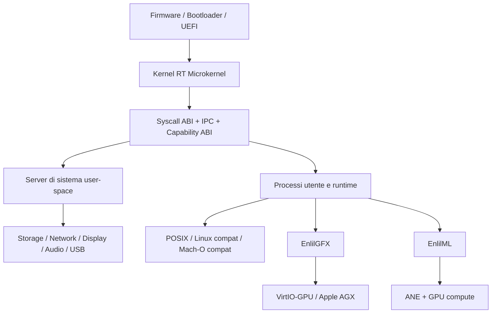

## 4. Principi Architetturali

### 4.1 Kernel piccolo, politiche fuori dal kernel

Il kernel deve contenere soprattutto:

- trap, syscall e gestione eccezioni
- scheduler realtime
- MMU e address space
- IPC e capability
- interrupt controller e timer
- primitive di sincronizzazione kernel
- meccanismi minimi per debug, panic e WCET

Il kernel non deve contenere in forma finale:

- filesystem policy
- stack TCP/IP completo
- window manager
- protocol server desktop
- driver di alto livello non critici

### 4.2 Realtime first

Ogni percorso caldo deve privilegiare:

- latenze bounded
- assenza di allocazioni non necessarie nei path critici
- priority donation o ceiling dove serve
- separazione netta tra path hard-RT e servizi best-effort

### 4.3 Esplicito invece di implicito

Questo principio ritorna in tutto il sistema:

- IPC sincrono esplicito
- capability esplicite
- fence GPU esplicite
- render pass dichiarativi
- pipeline state object immutabili
- nessuna sincronizzazione magica nei componenti ad alte prestazioni

## 5. Macro Architettura Target

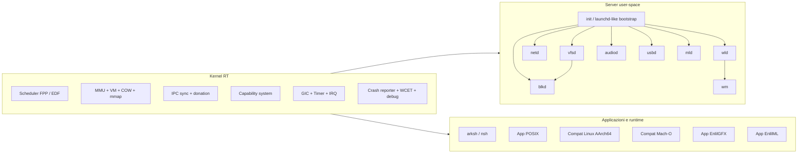

## 6. Percorso di Boot e Attivazione del Sistema

### 6.1 Fase bootstrap

`BACKLOG.md` stabilisce una fase di bootstrap che resta utile anche nel sistema finale:

1. firmware / bootloader carica il kernel AArch64
2. il kernel porta su MMU, PMM, heap, timer, scheduler, syscall, debug
3. il root iniziale e' `initrd-cpio`
4. da initrd parte il bootstrap userspace
5. i server essenziali vengono lanciati e prendono controllo dei sottosistemi

### 6.2 Fase target

Nel target finale il bootstrap deve convergere verso:

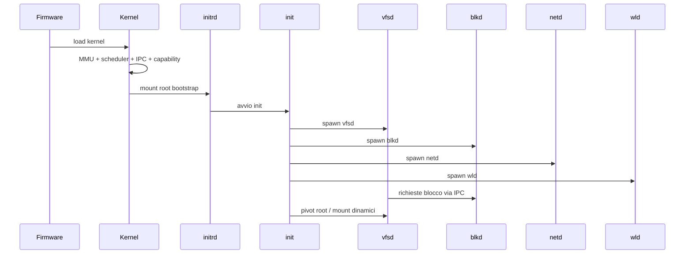

## 7. Kernel Target

### 7.1 Componenti permanenti

| Componente | Ruolo nel target |
|---|---|
| Exception / syscall layer | ingresso controllato da EL0 e da IRQ |
| Scheduler | FPP come base, EDF opzionale, supporto SMP |
| MMU | spazi per processo, COW, mmap anonimo e file-backed |
| IPC sync | cuore del microkernel e del modello server |
| Capability | sicurezza e delega di diritti |
| Primitive sync | `ksem`, `kmon`, segnali, futex/POSIX layer |
| Debug | crash reporter, watchdog, stack trace, ksym |

### 7.2 Componenti transitori da migrare fuori

| Componente oggi presente | Destinazione target |
|---|---|
| VFS in-kernel bootstrap | `vfsd` user-space |
| ext4 in-kernel bootstrap | filesystem server o `vfsd` + backend storage |
| block driver in-kernel bootstrap | `blkd` |
| parte della gestione display di bootstrap | `wld` / compositor |

### 7.3 Confine del kernel

Il kernel di EnlilOS deve essere il livello che garantisce:

- isolamento
- preemption
- temporizzazione
- ownership delle risorse
- trasferimento sicuro di diritti

e non il posto dove vive la logica applicativa o di policy.

## 8. Server Architecture Stile Hurd

`BACKLOG2.md` sposta EnlilOS verso un modello a server separati.

### 8.1 Server principali

| Server | Ruolo |
|---|---|
| `init` | bootstrap del sistema e policy di lancio |
| `vfsd` | namespace, mount, open/read/write/readdir/stat |
| `blkd` | accesso ai device a blocchi |
| `netd` | driver net + TCP/IP + socket service |
| `wld` | Wayland protocol server |
| `wm` | window management e policy desktop |
| `audiod` | mixing, buffer audio, codec software |
| `usbd` | enumerazione USB e dispatch class driver |
| `mld` | model server per AI |

### 8.2 Topologia server

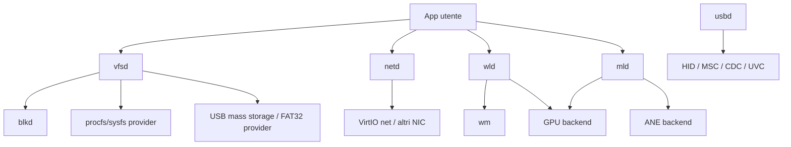

### 8.3 Perche' questa scelta

Vantaggi architetturali:

- isolamento dei fault
- minore blast radius di un bug driver
- riavvio di un server senza riavvio del kernel
- policy modulare
- migrazione piu' naturale verso capability e container

Costo da governare:

- piu' IPC
- piu' orchestrazione di bootstrap
- debugging distribuito piu' complesso

Il progetto accetta questo costo perche' il modello microkernel e' una scelta fondante,
non un dettaglio implementativo.

## 9. Process Model e Runtime

### 9.1 Evoluzione prevista

Dal backlog 1 e 2 il modello di processo finale comprende:

- `fork()` + COW
- `execve()` completo
- ELF statico e dinamico
- segnali POSIX
- process groups, sessions e job control
- `mmap()` anonimo e file-backed
- pthread e futex layer
- namespace e container support

### 9.2 Stack software user-space

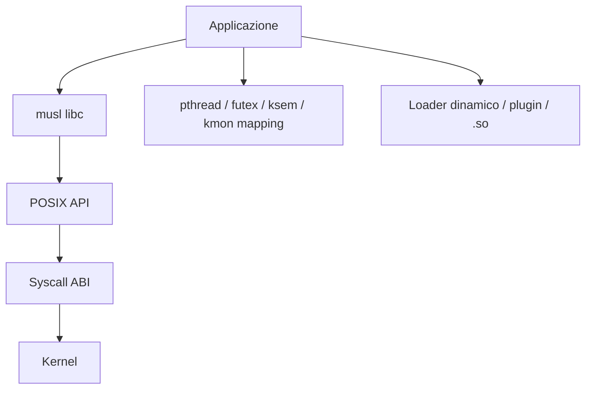

### 9.3 Shell e ambiente utente

L'evoluzione attesa e':

- `nsh` come shell di recovery / bootstrap
- `arksh` come shell normale di sistema
- environment completo (`PATH`, `HOME`, `PWD`, locale)
- terminal control (`termios`, `isatty`, pty)
- pipe, dup/dup2, job control, plugin e dynamic linking

## 10. Storage, Namespace e Persistenza

### 10.1 Struttura target

`BACKLOG.md` chiude il bootstrap storage, ma `BACKLOG2.md` porta il disegno finale verso
namespace dinamico e servizi fuori dal kernel.

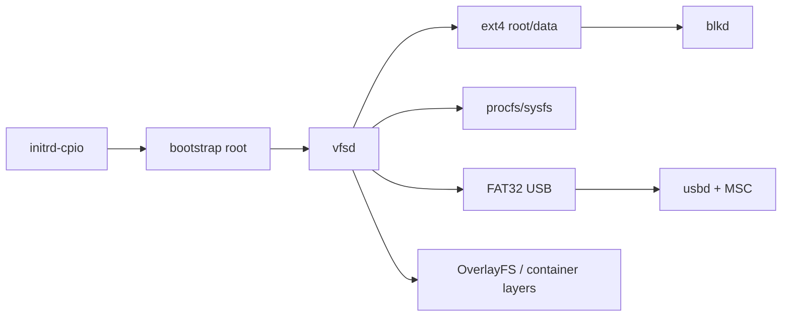

### 10.2 Obiettivi architetturali

- root bootstrap semplice e affidabile
- root persistente `ext4`
- mount dinamico e namespace per processo
- `pivot_root()` dal bootstrap a root reale
- supporto successivo a USB mass storage e layering container

## 11. Networking

### 11.1 Stack target

`BACKLOG2.md` delinea un classico percorso:

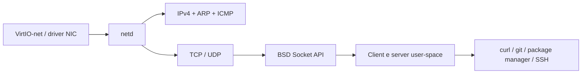

### 11.2 Proprieta' cercate

- UDP e polling non-blocking per i path piu' sensibili
- TCP come slow path best-effort
- AF_UNIX ottimizzato per comunicazione locale
- separazione netta tra driver, stack e API socket

## 12. Desktop e Grafica di Sistema

### 12.1 Desktop stack

Il backlog 1 costruisce la base display 2D. Il backlog 2 porta il sistema verso:

- `wld` come Wayland server minimale
- `wm` come policy manager
- compositor accelerato GPU
- input integrato da VirtIO, PS/2, USB HID

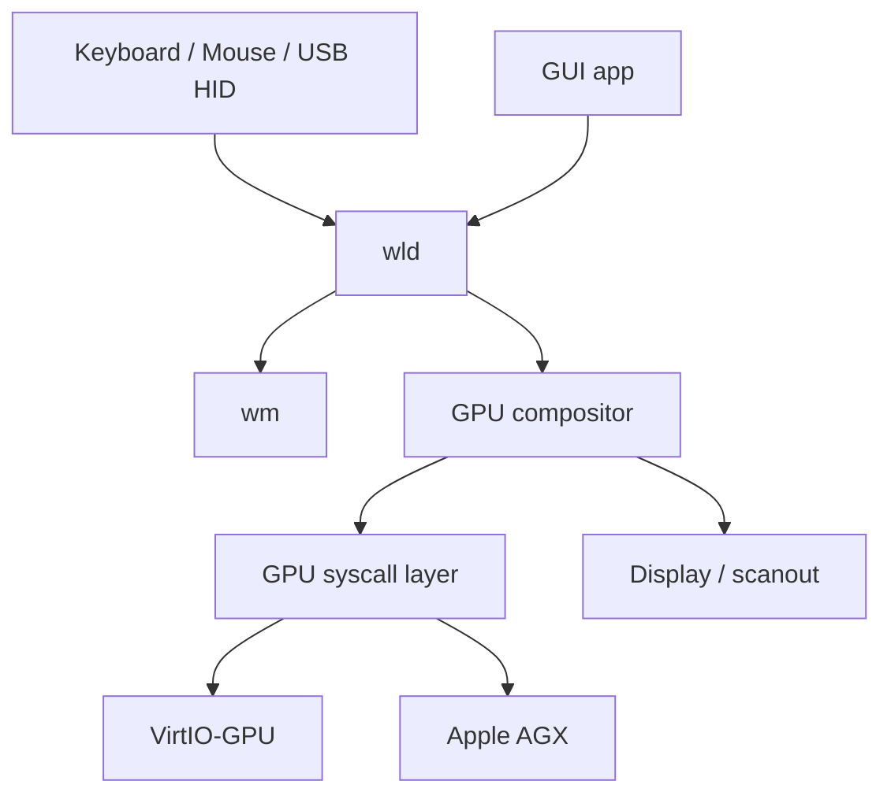

### 12.2 Regola importante

La grafica di bootstrap e la boot console non sono il desktop finale.
Sono un path di bring-up e recovery. Il desktop target nasce sopra Wayland e compositor.

## 13. Compatibilita' Software

### 13.1 Tre livelli di compatibilita'

| Livello | Obiettivo |
|---|---|
| POSIX / musl | compilare software C/C++ nativo per EnlilOS |
| Linux AArch64 | eseguire binari Linux con un layer syscall compatibile |
| Mach-O / dyld shim | eseguire un sottoinsieme di binari macOS AArch64 |

### 13.2 Architettura dei layer

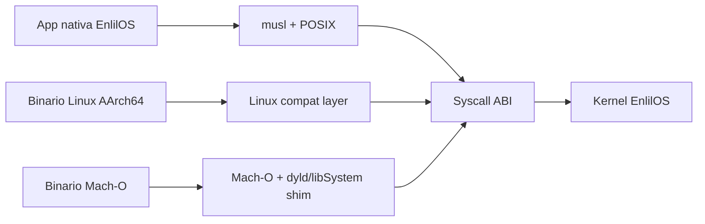

### 13.3 Significato architetturale

EnlilOS non vuole essere solo "un altro hobby kernel".
Vuole diventare un sistema capace di:

- eseguire software nativo ben integrato
- riusare ecosistemi esistenti
- fare da piattaforma di sviluppo reale

## 14. SMP, Scheduling Avanzato e Misure WCET

### 14.1 Evoluzione dello scheduler

| Fase | Obiettivo |
|---|---|
| Base | FPP deterministico |
| Avanzata | EDF opzionale |
| Multi-core | SMP AArch64 |
| Misurazione | framework WCET e telemetria temporale |

### 14.2 Vista concettuale SMP

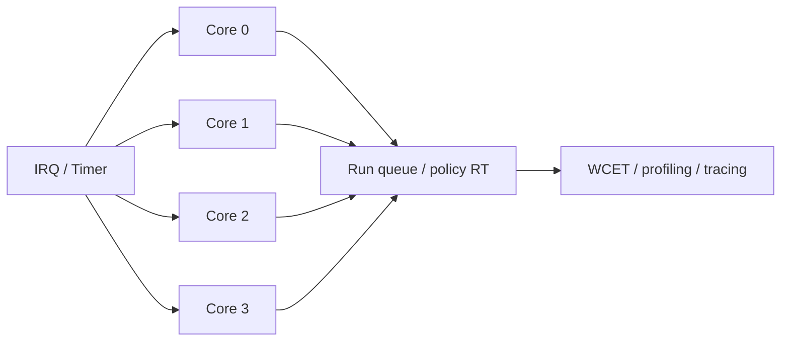

## 15. Audio e USB

### 15.1 Audio

Percorso target:

- driver `virtio-sound` o fallback legacy
- `audiod` in user-space
- syscall audio per app
- DSP software e codec in uno strato separato

### 15.2 USB

Percorso target:

- `xhci`
- hub management
- HID
- mass storage
- CDC-ACM
- webcam
- `usbd` come coordinatore

Questa parte rende EnlilOS un sistema davvero usabile su hardware reale e non solo in QEMU.

## 16. EnlilGFX: Stack 3D Target

`BACKLOG3.md` porta EnlilOS oltre il semplice compositor 2D.

### 16.1 Posizionamento architetturale

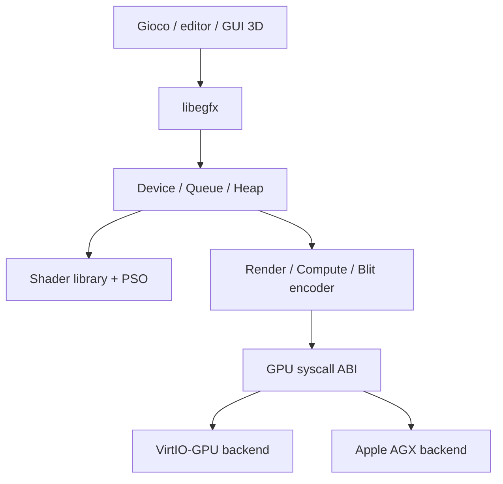

### 16.2 Obiettivi chiave

- API esplicita in stile Metal / DX12
- nessuno stato nascosto
- PSO immutabili
- render pass dichiarativi
- fence esplicite
- SPIR-V come IR
- fallback software dove utile

## 17. EnlilML: Stack AI Target

### 17.1 Ruolo nel sistema

EnlilML e' il framework AI di alto livello che unifica:

- ANE
- GPU compute
- tensor abstraction
- model loading
- inferenza orchestrata

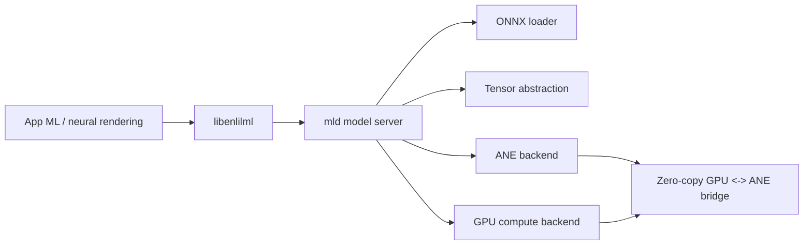

### 17.2 Usi strategici

- inferenza classica
- upscaling neurale
- denoising
- saliency-driven VRS
- neural material synthesis

## 18. Neural Rendering

Il backlog 3 non tratta AI e grafica come mondi separati.
Il target e' una piattaforma in cui il renderer puo' usare AI come parte del frame loop.

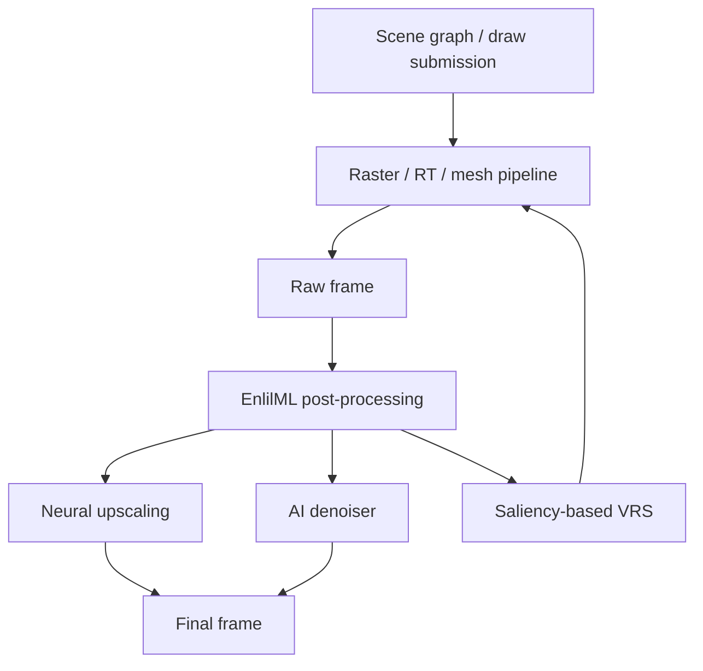

## 19. Piattaforme Target

| Piattaforma | Ruolo |
|---|---|
| QEMU `virt` | piattaforma di sviluppo primaria, bring-up, regressioni |
| Apple M-series | target hardware principale per AGX + ANE |
| VMware Fusion ARM64 | packaging e distribuzione di immagini virtuali |

## 20. Transizione da Oggi al Target

La traiettoria architetturale corretta e':

1. consolidare il nucleo realtime e le primitive base
2. spostare VFS e block layer in user-space con capability
3. completare libc, shell e process model
4. aggiungere networking e compatibilita' software
5. costruire desktop, SMP e osservabilita'
6. salire di livello con EnlilGFX ed EnlilML

## 21. Mappa Finale del Sistema

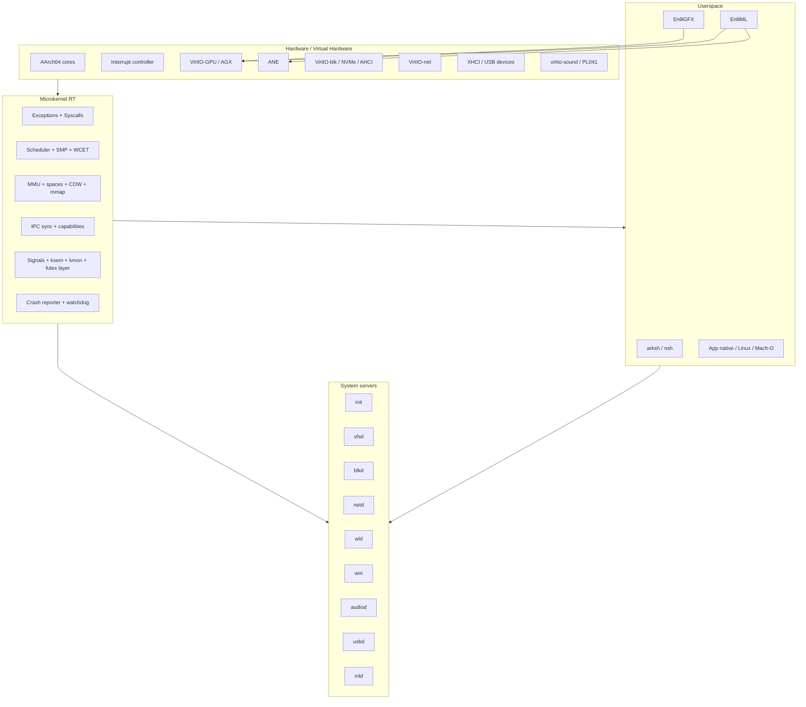

## 22. Conclusione

Il sistema target delineato dai tre backlog non e' un semplice kernel con qualche driver.
E' una piattaforma completa, con questa identita':

- microkernel realtime al centro
- server user-space come modello operativo normale
- compatibilita' pragmatica con ecosistemi esistenti
- stack grafico e AI nativi, non aggiunti a posteriori

In altre parole, EnlilOS vuole diventare:

- abbastanza rigoroso per il realtime
- abbastanza modulare per i server isolati
- abbastanza pratico per far girare software vero
- abbastanza ambizioso da offrire un percorso nativo verso 3D e AI

